# ST3R

**ST3R** — **S**tereo-seq **3D** **T**issue **R**econstruction Pipeline（立体时序 **3D** **组**织**重**建流水线）

一个面向 Stereo-seq 空间转录组学数据的 3D 重建流水线，执行多切片对齐、3D 组织建模、主干结构提取、形态学量化，以及在高密度 3D 体素网格上进行高斯过程基因表达插值。基于 [Spateo](https://github.com/aristoteleo/spateo-release) 构建。

> **English version**: [README.md](README.md)

<div align="center">

[](#license)
[](https://www.python.org)
[](#)
[](https://github.com/aristoteleo/spateo-release)

[](https://hub.docker.com/r/oyjhlovedocker/spateo_tdr)
[](https://doi.org/10.5281/zenodo.21776415)
[](#)
[](#安装)

</div>

---

## 项目简介

**ST3R** 是一个以 3D 重建为核心的 Stereo-seq 空间转录组学流水线。它围绕 Spateo 的 `tdr`（Three-Dimensional Reconstruction，三维重建）模块，将多张 2D Stereo-seq 切片转换为 3D 点云、网格和体素组织模型，进而量化组织形态，并将基因表达插值到连续的 3D 空间中。流水线内置一个 4 步的上游预处理链（Steps 01-05）用于产生 TDR 可用的输入，以及一个下游报告层（Step 11）将所有产物打包成可交付的 HTML/PDF 报告。

**适用场景**：需要 3D 坐标重建的 Stereo-seq 组织切片、发育生物学研究、类器官 3D 建模、基于重建解剖结构的空间转录组分析。

---

## 核心特性

- **以 3D 重建为核心**：以 Spateo `tdr` 模块为中心，Steps 07-10 涵盖点云 / 网格 / 体素构建、主干提取、形态学量化以及基于 GP 的基因表达插值。
- **GPU 加速 3D 流水线**：Steps 06（对齐）和 07（3D 重建）支持 CUDA 加速，自动回退到 CPU。
- **标准化 H5AD I/O**：所有中间产物使用 AnnData 格式，可与 Scanpy/Squidpy 生态无缝集成。
- **内置空间域检测**：基于 Squidpy 的联合图聚类在对齐前识别组织域。
- **多模型 3D 输出**：生成点云、网格表面和体素模型（VTK 格式），可在 ParaView / PyVista 中可视化。
- **基于主干的差异表达**：沿重建组织的主解剖轴进行 GLM 差异表达分析。
- **高斯过程插值**：从稀疏空间测量预测高密度 3D 体素网格上的基因表达。
- **自动化报告生成**：Step 11 将所有 PNG/HTML/CSV/JSON 产物聚合为交互式 HTML（约 47 KB）和分页 PDF（约 40 MB），无需重跑任何分析。
- **灵活的报告变体**：提供两个报告脚本——`11_report.py`（全流程，7 章节）和 `11_report_subset.py`（仅对齐 + TDR）。

---

## 流水线架构

流水线由 11 个按顺序执行的 Python 脚本组成，围绕 3D 重建核心分为三层：

| 层 | 步骤 | 用途 |
|-----|------|------|
| **上游预处理** | 01–05 | GEF → H5AD → QC → 空间域 → 清洗输入 |
| **3D 重建核心** ⚡ | 06–10 | 对齐 → 3D 模型 → 主干 → 形态学 → GP 插值 |
| **报告生成** | 11 | 将产物聚合为 HTML/PDF 报告 |

| 步骤 | 脚本 | Conda 环境 | 输入 | 输出 | 关键工具 |
|------|------|-----------|------|------|----------|
| 01 | `01_gef2h5ad.py` | `stereopy` | GEF 文件 / TSV 配置 | `{sample}.h5ad` | stereo |
| 02 | `02_concat.py` | `scanpy` | H5AD 目录 | `*_concated.h5ad` + QC 图 | anndata, scanpy |
| 03 | `03_preprocess.py` | `scanpy` | 合并后的 H5AD | `*_preprocessed.h5ad` + 聚类图 | scanpy, harmonypy |
| 04 | `04_squidpy.py` | `scanpy` | 预处理后的 H5AD | `*_squidpy.h5ad` + 空间域图 | squidpy, scanpy |
| 05 | `05_dataConvert.py` | `scanpy` | Squidpy H5AD | `*_compatible.h5ad` | scanpy |
| 06 | `06_align.py` ⚡ | `spateo_env` | 清洗后的 H5AD | `*_adata_aligned.h5ad` + 对齐图 | spateo, torch (CUDA) |
| **07** | **`07_tdr.py` ⚡** | `spateo_env` | 对齐后 H5AD + 清洗后 H5AD | `*.vtk`（点云/网格/体素）+ `*_tdr.h5ad` | **spateo.tdr**, pyvista, torch (CUDA) |
| **08** | **`08_backbone.py`** | `spateo_env` | TDR H5AD + VTK 模型 | `glm_data.csv` + 主干模型 | **spateo.tdr**, pyvista |
| **09** | **`09_morph.py`** | `spateo_env` | 点云 + 网格 VTK 模型 | `*_morph.json` + KDE 图 | **spateo.tdr**, pyvista |
| **10** | **`10_interpolation.py`** | `spateo_env` | TDR H5AD + VTK 模型 + GLM CSV | `*_interpolated_gp_adata.h5ad` + 插值图 | **spateo.tdr.gp_interpolation** |
| 11 | `11_report.py` | `scanpy` | Output 根目录（Steps 01-10） | `report.html` + `report.pdf` + 资源 | jinja2, playwright, pypdf2 |

> ⚡ = GPU 加速（CUDA 可选，自动回退到 CPU）
> **粗体行 = 3D 重建核心**（Steps 07-10），均基于 Spateo 的 `tdr` 模块。
> Step 11 与 Steps 02-05 共享 `scanpy` 环境，其依赖（jinja2、playwright、pypdf2）一并安装。
> Step 11 不重跑任何分析，仅聚合 Steps 01-10 产出的产物。

---

## 环境要求

| 组件 | 要求 | 备注 |
|------|------|------|
| 操作系统 | Linux (Ubuntu 20.04+ 推荐) | macOS 与 WSL2 也支持；Windows 原生未测试 |
| Conda | Anaconda / Miniconda / Miniforge ≥ 23.x | 推荐使用 [Miniforge](https://github.com/conda-forge/miniforge) |
| 磁盘 | ≥ 15 GB 可用 | 3 个环境合计约 9-12 GB |
| 内存 | ≥ 16 GB | 用于 > 100K 细胞的数据集 |
| GPU（可选） | 支持 CUDA 11.8+ 的 NVIDIA GPU | Steps 06 和 07 支持 GPU 加速 |

---

## 安装

> ⚠️ **注意**：完整安装步骤请参见 **[INSTALL.zh-CN.md](INSTALL.zh-CN.md)**（[English](INSTALL.md)）。
> 推荐使用容器镜像，可完整复现用于验证 `example/` 参考结果的环境。

### 方式 1 — 使用预构建容器镜像（推荐）

Docker Hub 上提供了预构建镜像，内置全部 3 个 conda 环境（`stereopy`、`scanpy`、`spateo_env`）；对应的 Singularity `.sif` 文件归档在 Zenodo（[10.5281/zenodo.21776415](https://doi.org/10.5281/zenodo.21776415)），可作为长期引用源。

```bash
# Docker
docker pull oyjhlovedocker/spateo_tdr:v1

# Singularity / Apptainer — 从 Docker Hub 实时转换（后续 exec 均需加 --cleanenv --no-mount tmp）
singularity pull spateo_tdr.sif docker://oyjhlovedocker/spateo_tdr:v1

# 或直接从 Zenodo 下载预构建的 .sif（推荐用于无法访问 Docker Hub 的 HPC 集群）
wget -O spateo_tdr.sif https://zenodo.org/records/21776415/files/spateo_tdr.sif
```

> **Singularity 用户提示**：所有 `singularity exec` 都需要加 `--cleanenv`。仅 Steps 06-10 需再加 `--no-mount tmp --nv`——因为镜像构建时 `spateo_env` conda 环境被安装在容器的 `/tmp` 下，若 Singularity 把宿主机 `/tmp` 绑定进来会把它遮蔽。详见 [INSTALL.zh-CN.md §2.2](INSTALL.zh-CN.md#22-验证镜像)。

然后调用任意步骤（GPU 步骤需 `--gpus all` / `--nv`）：

```bash
# Docker — Step 01
docker run --rm \
    -v $(pwd):/work -w /work \
    oyjhlovedocker/spateo_tdr:v1 \
    conda run -n stereopy python /work/Scripts/01_gef2h5ad.py \
        -C /work/rawData/sample_list.tsv -BT cell_bins -O /work/Output/01_gef2h5ad

# Docker — Step 07（GPU）
docker run --rm --gpus all \
    -v $(pwd):/work -w /work \
    oyjhlovedocker/spateo_tdr:v1 \
    conda run -n spateo_env python /work/Scripts/07_tdr.py \
        -AD /work/Output/06_alignment/Sol_adata_aligned.h5ad \
        -RD /work/Output/05_dataConvert/Sol_compatible.h5ad \
        -P Sol_ -O /work/Output/07_tdr
```

仓库内置一键驱动脚本（参见 [INSTALL.zh-CN.md §2.5](INSTALL.zh-CN.md#25-一键运行全流程)），可一键跑完整流程。

### 方式 2 — 手动安装 conda 环境

如果无法运行容器，请使用仓库提供的 yml 文件创建 3 个 conda 环境：

```bash
mamba env create -f envs/stereopy.yml
mamba env create -f envs/scanpy.yml
mamba env create -f envs/spateo_env.yml

# Step 11 需要 headless Chromium 进行 PDF 渲染
conda run -n scanpy playwright install chromium
```

| Conda 环境 | Python | 步骤 | 关键包 |
|-----------|--------|------|--------|
| `stereopy` | 3.8 | 01 | stereopy, pandas |
| `scanpy` | 3.12 | 02-05, 11 | scanpy, squidpy, anndata, jinja2, playwright, pypdf2 |
| `spateo_env` | 3.10 | 06-10 | spateo-release, torch (CUDA), pyvista |

安装完成后，使用仓库自带 `run.sh` 包装脚本（无需配置，仅需 `chmod +x run.sh`）调用脚本，无需修改脚本中硬编码的 shebang：

```bash
./run.sh 01_gef2h5ad.py -C rawData/sample_list.tsv -BT cell_bins -O Output/01_gef2h5ad
```

GPU 配置、镜像源、故障排查等详细说明见 **[INSTALL.zh-CN.md](INSTALL.zh-CN.md)**。

---

## 使用方法

> ⚠️ **注意**：以下 shell 命令仅为**参考示例**。参数值（尤其是 QC 相关的 `-minC`、`-maxMT`）需根据具体数据集调整。运行前请先执行 `./run.sh <script>.py --help` 查看完整参数列表。

> **v2 变化**：质控与标准化已前移到 **Step 02**（per-sample 执行后合并）；Step 03 回归纯下游分析（HVG/降维/聚类），不再接收 QC 参数。Step 02 移除了手动阈值参数 `-minG/-maxG/-minU/-maxU/-maxHB`——n_genes / total_counts 阈值改为按切片自动分位数（默认 1%/99%，可用 `-qL`/`-qH` 调整），只需提供 `-minC`（基因最少细胞数）和 `-maxMT`（线粒体比例上限）。**v2 未改变任何运行环境，已发布的 Docker / Singularity 镜像（`oyjhlovedocker/spateo_tdr:v1`）继续适用。**

> **执行模式**：本流水线当前**仅支持手动分步骤执行**。每一步需在前一步输出存在后，通过 `./run.sh <script>.py ...` 显式调用。请勿尝试在单条命令中自动化整个流水线。

### 快速开始——运行完整流水线

```bash
# Step 01：GEF 转 H5AD
./run.sh 01_gef2h5ad.py -C rawData/sample_list.tsv -BT cell_bins -O Output/01_gef2h5ad

# Step 02：质控 + 标准化 + 合并（per-sample，QC 阈值按切片自动计算，可选 -qL/-qH 调整）
./run.sh 02_concat.py -I Output/01_gef2h5ad -O Output/02_concat -P Sol_ \
    -minC 3 -maxMT 10

# Step 03：下游分析（HVG / 降维 / 聚类，输入 X 已 log1p 标准化）
./run.sh 03_preprocess.py -I Output/02_concat/Sol_concated.h5ad -BK batch -P Sol_ -O Output/03_preprocess

# Step 04：空间域检测
./run.sh 04_squidpy.py -I Output/03_preprocess/Sol_preprocessed.h5ad -LK slice_id -P Sol_ -O Output/04_squidpy \
    -R 1.2 -WS 0.8

# Step 05：数据清洗（适配 Spateo）
./run.sh 05_dataConvert.py -I Output/04_squidpy/Sol_squidpy.h5ad -P Sol_ -O Output/05_dataConvert

# Step 06：3D 对齐（GPU 加速）
./run.sh 06_align.py -I Output/05_dataConvert/Sol_compatible.h5ad -P Sol_ -O Output/06_alignment

# Step 07：3D 组织重建（GPU 加速）
./run.sh 07_tdr.py -AD Output/06_alignment/Sol_adata_aligned.h5ad -RD Output/05_dataConvert/Sol_compatible.h5ad -P Sol_ -O Output/07_tdr

# Step 08：主干提取 + GLM 差异表达
./run.sh 08_backbone.py -AD Output/07_tdr/Sol_tdr.h5ad -PC Output/07_tdr/Sol_aligned_pc_model.vtk \
    -MS Output/07_tdr/Sol_aligned_mesh_model.vtk -P Sol_ -O Output/08_backbone

# Step 09：形态学特征
./run.sh 09_morph.py -PC Output/07_tdr/Sol_aligned_pc_model.vtk -MS Output/07_tdr/Sol_aligned_mesh_model.vtk -P Sol_ -O Output/09_Morph

# Step 10：高斯过程插值
./run.sh 10_interpolation.py -AD Output/07_tdr/Sol_tdr.h5ad -PC Output/07_tdr/Sol_aligned_pc_model.vtk \
    -MS Output/07_tdr/Sol_aligned_mesh_model.vtk -VX Output/07_tdr/Sol_aligned_voxel_model.vtk \
    -GL Output/08_backbone/glm_data.csv -P Sol_ -O Output/10_interpolation -NG 3 -NS 15

# Step 11a：完整客户报告（HTML + PDF，7 章节）
./run.sh 11_report.py -I Output -P Sol_ -SL rawData/sample_list.tsv -O Output/11_report

# Step 11b：精简报告（仅对齐 + TDR，2 章节）
./run.sh 11_report_subset.py -I Output -P Sol_ -SL rawData/sample_list.tsv -O Output/11_report_subset
```

完整参数文档见 [`Spateo_pipeline_SOP.pdf`](Spateo_pipeline_SOP.pdf)。

#### 单步调试

每个脚本都可以基于前一步的输出独立重新运行。参考**流水线架构**中的依赖关系表。

---

## 输出文件

每个步骤在 `Output/` 下写入编号子目录：

| 步骤 | 输出目录 | 关键文件 |
|------|----------|----------|
| 01 | `Output/01_gef2h5ad/` | `{sample_id}.cellbin.h5ad`（每个样本一个） |
| 02 | `Output/02_concat/` | `{prefix}_concated.h5ad`（X 已 log1p 标准化），QC 小提琴图/散点图（before/after） |
| 03 | `Output/03_preprocess/` | `{prefix}_preprocessed.h5ad`，PCA，UMAP，marker 基因热图，`{prefix}_all_markers.csv` |
| 04 | `Output/04_squidpy/` | `{prefix}_squidpy.h5ad`，空间域网格图，Leiden 对比 UMAP |
| 05 | `Output/05_dataConvert/` | `{prefix}_compatible.h5ad` |
| 06 | `Output/06_alignment/` | `{prefix}_adata_aligned.h5ad`，对齐前后切片图，叠加对比 |
| 07 | `Output/07_tdr/` | `{prefix}_aligned_pc_model.vtk`，`{prefix}_aligned_mesh_model.vtk`，`{prefix}_aligned_voxel_model.vtk`，`{prefix}_tdr.h5ad`，交互式 HTML 查看器 |
| 08 | `Output/08_backbone/` | `{prefix}_backbone_model.vtk`，`glm_data.csv`，Top 9 差异基因 GLM 拟合图，`{prefix}_backbone.h5ad` |
| 09 | `Output/09_Morph/` | `{prefix}_morph.json`（长/宽/高/表面积/体积/密度），KDE 热图，`{prefix}_aligned_pc_KDE_model.vtk` |
| 10 | `Output/10_interpolation/` | `{prefix}_interpolated_gp_adata.h5ad`，原始 vs 插值表达图，3D 切片视图，`{prefix}_interpolated_gp_pc.vtk` |
| 11 | `Output/11_report/` | `report.html`（约 47 KB 交互式），`report.pdf`（约 40 MB 分页版），`assets/`，`images/`（24 张图，7 个章节子目录），`viz/`（交互式 3D iframe），`data/`（CSV/JSON） |

---

## 示例：参考测试运行（33 个切片）

`example/` 中包含一份完整的 33 个 Stereo-seq 切片测试运行示例。

### 3.1 Step 02：质控（per-sample）

**QC 前后对比**：

**QC 前**：

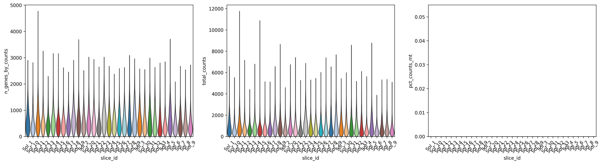

**QC 后**：

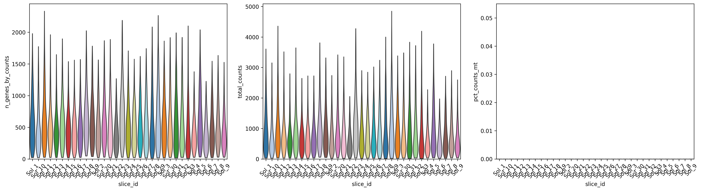

### 3.2 Step 03：下游分析（HVG、降维、聚类）

**PCA 方差解释与 UMAP 聚类**：

| PCA 方差解释率 | UMAP（Leiden）|
|----------------|---------------|
| 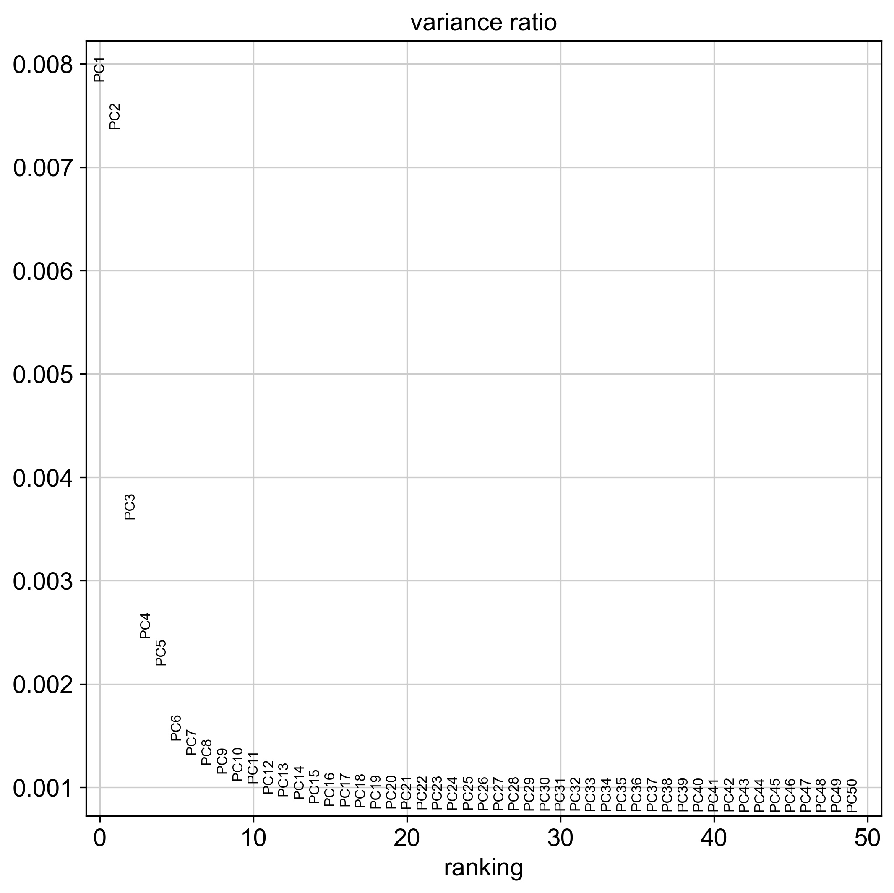 | 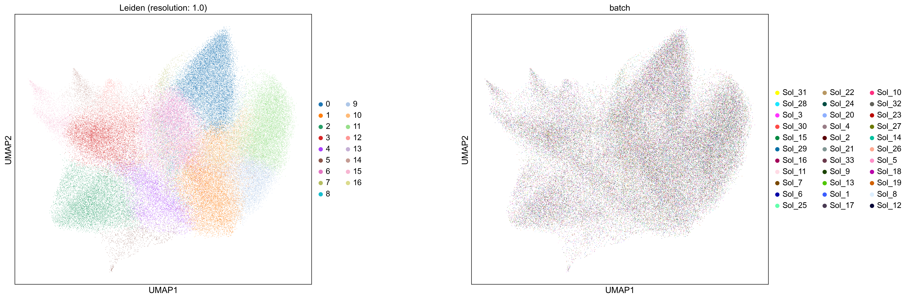 |

---

### 3.2 Step 04：空间域检测（Squidpy）

**空间域网格**：


**Leiden vs Squidpy 空间域对比**：

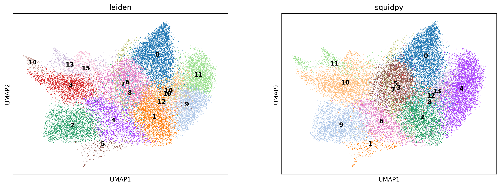

---

### 3.3 Step 06：3D 对齐

**对齐前**：


**对齐后**：

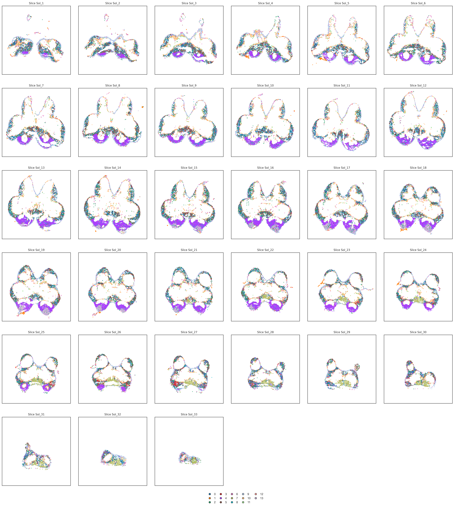

**对齐前后叠加对比**：


---

### 3.4 Step 07：3D 组织重建（TDR）

**点云、网格与体素模型**：

| 点云 | 网格表面 | 体素 |
|------|---------|------|
| 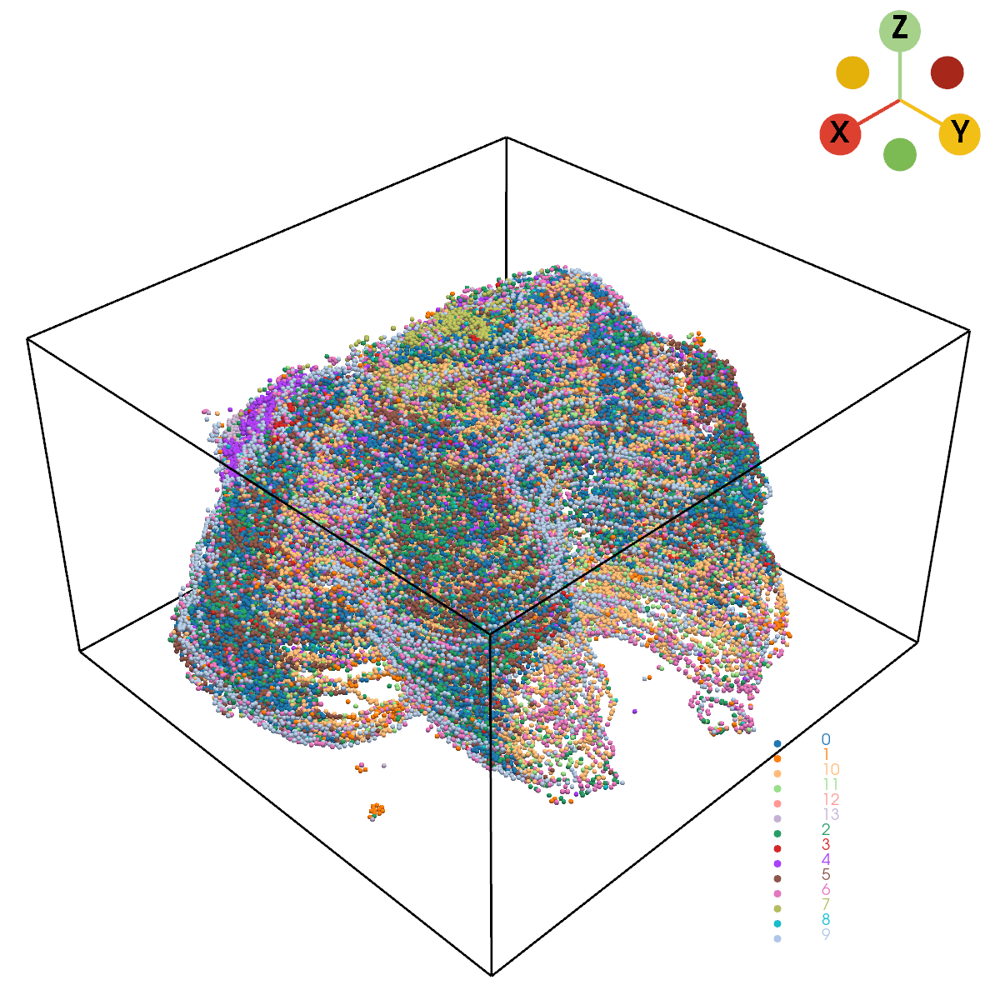 | 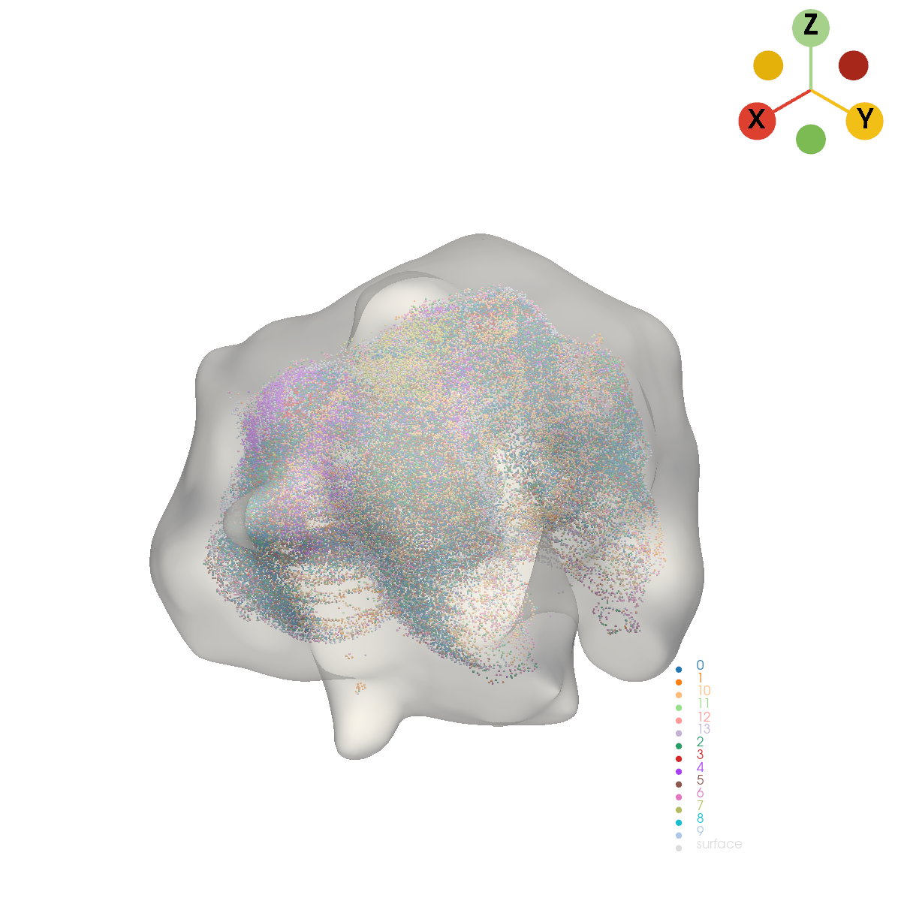 |  |

**正交三视图投影**：

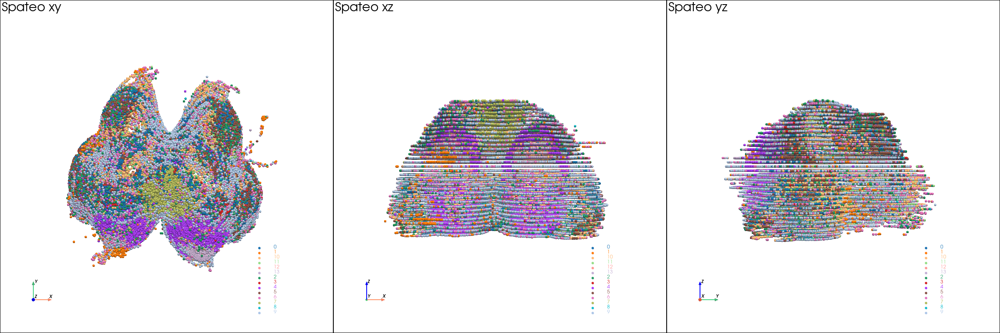

---

### 3.5 Step 08：主干提取 + GLM 差异表达

| 主干 3D | 主干节点着色 |
|---------|--------------|
| 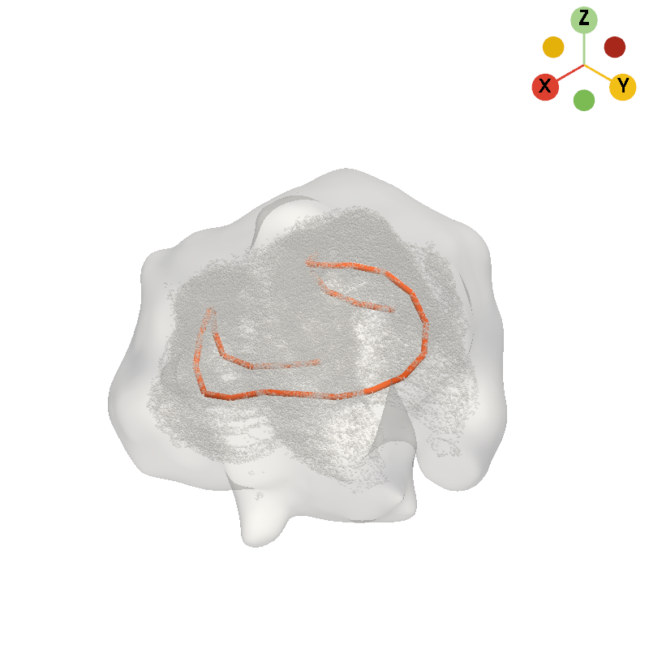 | 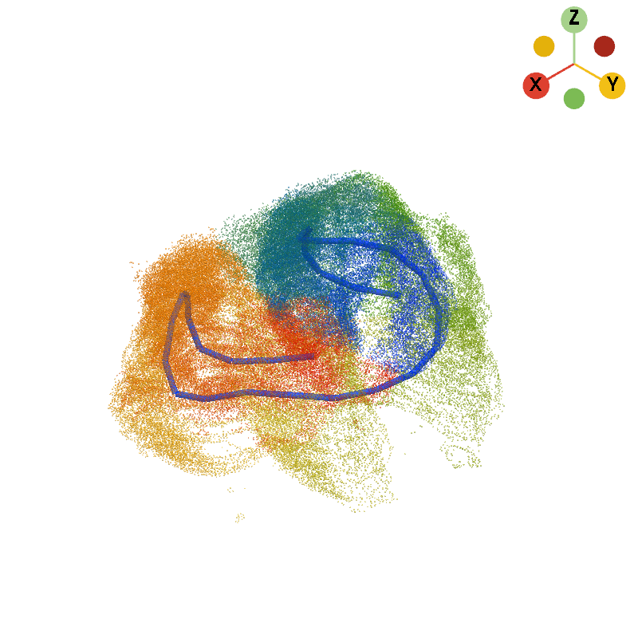 |

**Top 9 差异基因——GLM 拟合**：


---

### 3.6 Step 09：形态学特征

**细胞密度 KDE 热图**：

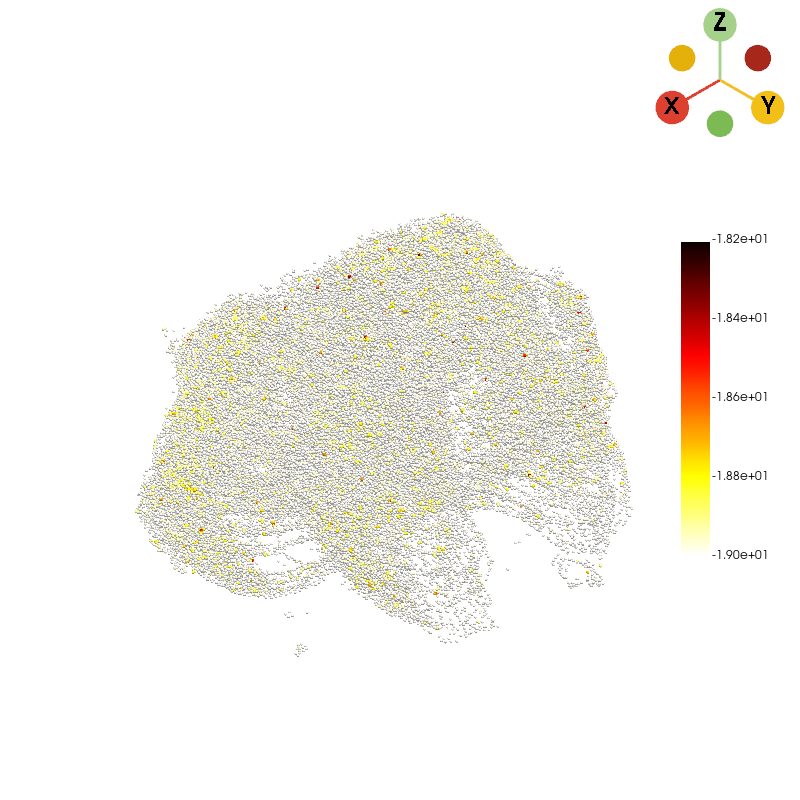

---

### 3.7 Step 10：高斯过程插值

**原始表达**：

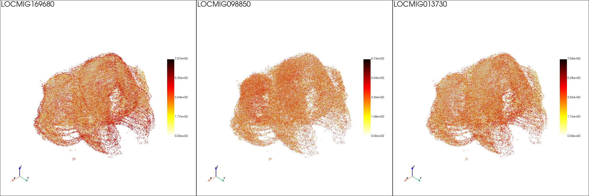

**GP 插值后表达**：

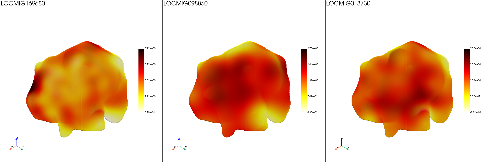

**3D 切片视图**：

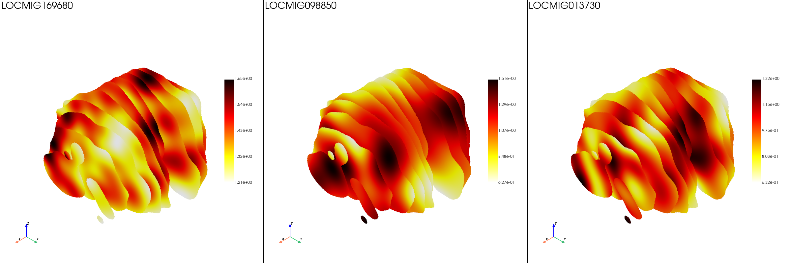

---

## 注意事项

1. **Step 08 GLM 运行时长**：GLM 差异表达步骤的计算量随细胞数增长，对于大型数据集可能需要数小时至数天。可减小 `-NN`（主干节点数）以加速探索性运行。
2. **Step 10 GP 插值运行时长**：高密度体素网格上的 GP 插值计算开销大。`-NG`（基因数）和 `-NS`（切片数）参数直接控制内存和运行时长。
3. **Step 11 PDF 体积**：完整的 Step 11a PDF 约 40 MB，因为 3D 模型以静态截图嵌入。可使用 `--no-pdf` 仅生成轻量 HTML（约 47 KB）以便快速预览。
4. **命名前缀耦合**：Steps 02-10 中使用的 `{prefix}`（如 `Sol_`）必须保持一致。若修改，所有下游的 `-I` 路径和 `-P` 参数必须同步更新。
5. **样本列表 TSV 路径**：`sample_list.tsv` 中所有 `gef_path` 必须为绝对路径。相对路径在批处理时会静默失败。
6. **Bin 类型选择**：`cell_bins` 生成细胞分辨率表达数据，推荐用于多数场景。`bins` 模式需设置 `-BS`（默认 50，单位 μm），生成固定网格数据，更适合细胞类型反卷积。
7. **Z 轴排序**：3D 模型中的切片 Z 坐标取自 `slice_id` 的数字后缀（如 `Sol_1`、`Sol_2` 等）。请使用一致的数字后缀方案。
8. **GPU 内存**：对于 > 500K 细胞的数据集，Steps 06 和 07 至少需要 16 GB GPU 内存。
9. **中间产物磁盘空间**：33 个切片（cell-bin 数据集）约产生 5-10 GB 的中间 H5AD/VTK 文件。请预留足够磁盘；除非计划重新运行，否则不要删除中间产物。

---

## 项目结构

```
.
├── README.md                       # 英文文档
├── README.zh-CN.md                 # 中文文档（本文件）
├── INSTALL.md                      # 英文安装指南
├── INSTALL.zh-CN.md                # 中文安装指南
├── Spateo_pipeline_SOP.pdf         # 详细标准操作规程（PDF）
├── run.sh                          # Conda 感知包装脚本（调用任意步骤）
├── Scripts/                        # 流水线脚本（11 个顺序步骤）
│   ├── 01_gef2h5ad.py              # Step 01：GEF → H5AD 转换
│   ├── 02_concat.py                # Step 02：per-sample QC + 标准化 + 合并
│   ├── 03_preprocess.py            # Step 03：下游分析（HVG / 降维 / 聚类）
│   ├── 04_squidpy.py               # Step 04：空间域检测
│   ├── 05_dataConvert.py           # Step 05：H5AD 清洗
│   ├── 06_align.py                 # Step 06：3D 对齐（GPU）
│   ├── 07_tdr.py                   # Step 07：3D 组织重建（GPU）
│   ├── 08_backbone.py              # Step 08：主干 + GLM 差异表达
│   ├── 09_morph.py                 # Step 09：形态学特征
│   ├── 10_interpolation.py         # Step 10：GP 插值
│   ├── 11_report.py                # Step 11a：完整客户报告（HTML + PDF）
│   ├── 11_report_subset.py         # Step 11b：精简报告（仅对齐 + TDR）
│   └── Report_config/              # Step 11 配置包
│       ├── config.yaml             # 报告章节开关
│       ├── templates/              # Jinja2 HTML 模板 + PDF 封面
│       ├── lib/                    # 渲染、内容、采集辅助函数
│       └── assets/                 # CSS、Logo、工作流图
├── envs/                           # Conda 环境定义
│   ├── stereopy.yml
│   ├── scanpy.yml
│   └── spateo_env.yml
└── example/                       # 参考测试运行产物（33 个切片）
    ├── 02_concat/                  # QC 图（before/after violin + scatter）
    ├── 03_preprocess/              # UMAP、PCA、marker
    ├── 04_squidpy/                 # 空间域网格
    ├── 06_alignment/               # 对齐前后图
    ├── 07_tdr/                     # 3D 重建产物
    ├── 08_backbone/                # 主干 + GLM 差异表达结果
    ├── 09_Morph/                   # 形态学产物
    └── 10_interpolation/           # GP 插值产物
```

---

## 联系方式

如有疑问、Bug 报告或功能请求，请提交 Issue 或 Pull Request。

**Email**: oyjh417701@163.com

## 版权

Copyright (c) 2026 OYJH. All Rights Reserved.

## 许可证

本项目使用 **MIT 许可证** — 完整文本参见 [`LICENSE`](LICENSE) 文件。

## 致谢

本流水线集成了以下优秀的开源工具：

- [Spateo](https://github.com/aristoteleo/spateo-release) — 空间转录组对齐、3D 重建、GP 插值
- [StereoPy](https://github.com/BGI-Shenzhen/StereoPy) — Stereo-seq GEF 文件 I/O
- [Scanpy](https://github.com/scverse/scanpy) — 单细胞预处理与分析
- [Squidpy](https://github.com/scverse/squidpy) — 空间邻域图构建
- [PyVista](https://github.com/pyvista/pyvista) — 3D 网格与体积渲染
- [AnnData](https://github.com/scverse/anndata) — 注释数据矩阵格式
- [Jinja2](https://github.com/pallets/jinja) — 报告模板引擎
- [Playwright](https://github.com/microsoft/playwright) — 无头 Chromium HTML→PDF 渲染
- [PyPDF2](https://github.com/py-pdf/PyPDF2) — PDF 合并与大纲提取

<br />
<br />